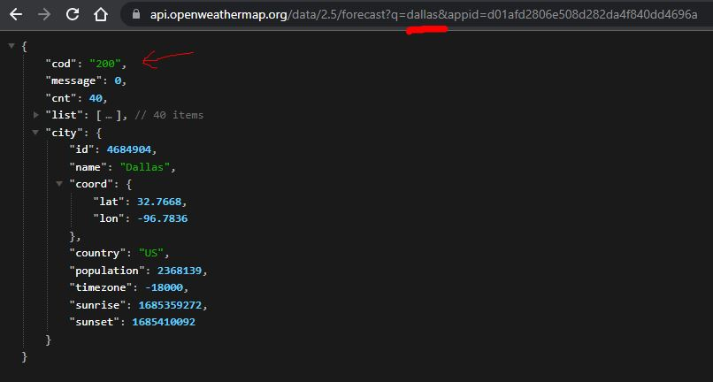

# Weather App

## *Description*
This is a very simple weather application that uses the OpenWeather API to retrieve weather data for a given city. The user can search for a city and the app will display the current weather conditions for that city.
 
 

### ***Some notes about the Python requests module:*** 
 - Allows for the use of sending http methods such as 'GET', 'POST', 'PUT', 'DELETE', etc. The response from the server can be accessed through the 'Response' object. 
 - This module allows us to pass query parameters and request data. 
 - You can handle errors and exceptions that may occur during the request by checking the response status code or using the raise_for_status() method (although I did not use them in this project). 

### ***Some notes about the Python json module:*** 
 - The json module allows you to encode (serialize) Python objects into JSON format and decode (deserialize) JSON data into Python objects. 
 - json.dumps() is used to convert a Python object into a JSON string representation. 
 - json.loads() is used to parse a JSON string and convert it back into a Python object. 
 - The module supports pretty printing of JSON data for better readability using the json.dumps() function with the indent parameter. 
 

### ***Some notes about the Python f-strings:*** 
 - The f-string is basically the Javascript equivalent of a template literal (created with backticks) which allows the embedding of expressions within strings. 
 - Notice the first example below is a standard string assigned to a variable, but the second example allows for the use of {city} and {api_key} to be embedded. 
 - `api_key = "d01afd2806e508d282da4f840dd4696a"` 
 - `base_url = f"http://api.openweathermap.org/data/2.5/weather?q=`{city}`&appid=`{api_key}`"` 
 

 

## *Installation & Usage*
To install this app, simply clone the repository and run the `weather.py` file in your terminal.
 
When prompted: 
 - Type the name of the city you wish to query the weather for. 
 

 
 

## *Questions*
<h3>Portfolio:&emsp;<a href="https://jk377y.dev" target="_blank">https://jk377y.dev</a></h3>
<h3>Email:&emsp;<a href="mailto:jk377y@gmail.com" target="_blank">jk377y@gmail.com</a></h3>
<h3>LinkedIn:&emsp;<a href="https://www.linkedin.com/in/james-kelly-software-developer/" target="_blank">https://www.linkedin.com/in/james-kelly-software-developer/</a></h3>
<h3>GitHub:&emsp;<a href="https://github.com/jk377y" target="_blank">https://github.com/jk377y</a></h3>
 
 

## *License*

 Copyright (c) 2023 James Kelly
 Information on this license can be found at: (https://opensource.org/licenses/MIT)